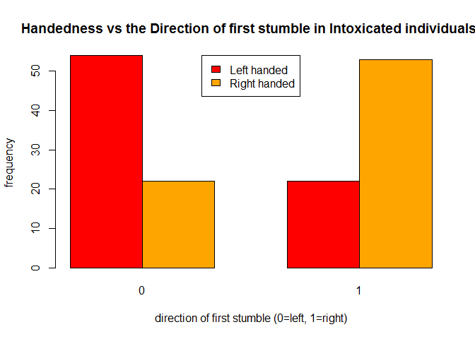
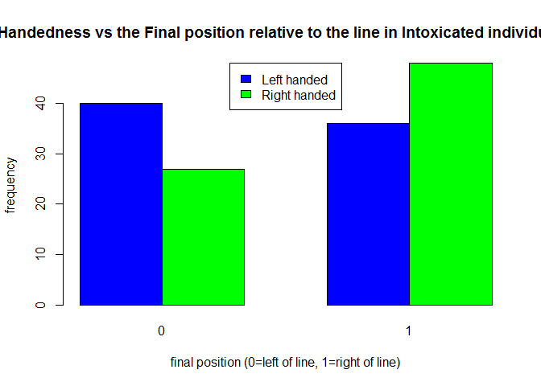
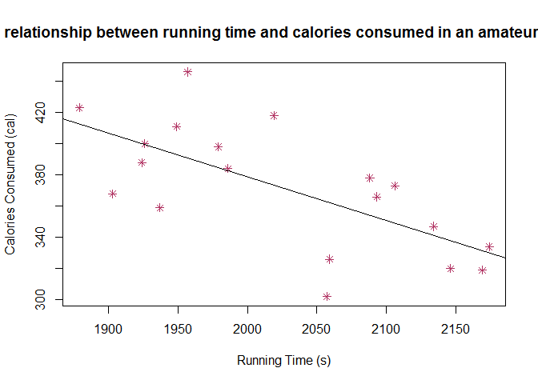
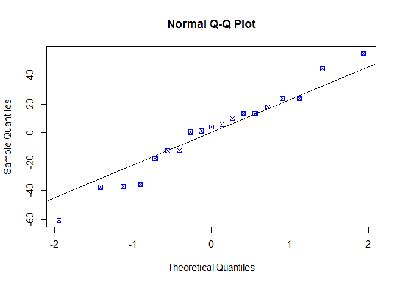
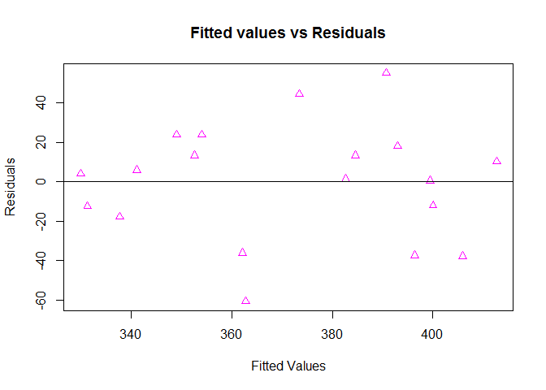

Stats Exam
================
Sihle Dakile

Question 1
==========

Body Temp in Males and Females
------------------------------

-   Null Hypothesis- There is no difference in increments of body temperature between males and females.
-   Alternative Hypothesis- There is a difference in increments ofbody temperature between males and females.

-   The data is continuous and has two, unpaired groups. I will use an unpaired t.test for hypothesis testing.

-   Test assumptions- there is equal variance across groups the data is matched the distribution is Gaussian

-   Other Questions to be answered -Do changes in body temperature have an association with heart rate? -Are the heart rate changes similar across the groups?

``` r
temp <- read.csv('question1.csv')
temp
```

    ##     body_temperature male female
    ## 1               35.7   70     NA
    ## 2               35.8   NA     69
    ## 3               35.9   71     NA
    ## 4               35.9   NA     62
    ## 5               36.0   NA     75
    ## 6               36.1   74     NA
    ## 7               36.1   80     NA
    ## 8               36.2   73     NA
    ## 9               36.2   75     NA
    ## 10              36.2   82     NA
    ## 11              36.2   64     NA
    ## 12              36.2   NA     66
    ## 13              36.2   NA     68
    ## 14              36.3   69     NA
    ## 15              36.3   70     NA
    ## 16              36.3   68     NA
    ## 17              36.3   72     NA
    ## 18              36.3   78     NA
    ## 19              36.3   NA     57
    ## 20              36.4   70     NA
    ## 21              36.4   75     NA
    ## 22              36.4   74     NA
    ## 23              36.4   69     NA
    ## 24              36.4   73     NA
    ## 25              36.4   NA     61
    ## 26              36.5   77     NA
    ## 27              36.5   NA     84
    ## 28              36.5   NA     61
    ## 29              36.6   58     NA
    ## 30              36.6   73     NA
    ## 31              36.6   65     NA
    ## 32              36.6   74     NA
    ## 33              36.6   76     NA
    ## 34              36.6   72     NA
    ## 35              36.6   NA     77
    ## 36              36.6   NA     62
    ## 37              36.6   NA     71
    ## 38              36.6   NA     68
    ## 39              36.6   NA     69
    ## 40              36.6   NA     79
    ## 41              36.7   78     NA
    ## 42              36.7   71     NA
    ## 43              36.7   74     NA
    ## 44              36.7   67     NA
    ## 45              36.7   64     NA
    ## 46              36.7   78     NA
    ## 47              36.7   73     NA
    ## 48              36.7   67     NA
    ## 49              36.7   NA     76
    ## 50              36.7   NA     87
    ## 51              36.7   NA     78
    ## 52              36.7   NA     73
    ## 53              36.7   NA     89
    ## 54              36.7   NA     81
    ## 55              36.8   66     NA
    ## 56              36.8   64     NA
    ## 57              36.8   71     NA
    ## 58              36.8   72     NA
    ## 59              36.8   86     NA
    ## 60              36.8   72     NA
    ## 61              36.8   NA     73
    ## 62              36.8   NA     64
    ## 63              36.8   NA     65
    ## 64              36.8   NA     73
    ## 65              36.8   NA     69
    ## 66              36.8   NA     57
    ## 67              36.8   NA     79
    ## 68              36.8   NA     78
    ## 69              36.8   NA     80
    ## 70              36.9   68     NA
    ## 71              36.9   70     NA
    ## 72              36.9   82     NA
    ## 73              36.9   84     NA
    ## 74              36.9   68     NA
    ## 75              36.9   71     NA
    ## 76              36.9   NA     79
    ## 77              36.9   NA     81
    ## 78              36.9   NA     73
    ## 79              36.9   NA     74
    ## 80              36.9   NA     84
    ## 81              36.9   NA     83
    ## 82              37.0   77     NA
    ## 83              37.0   78     NA
    ## 84              37.0   83     NA
    ## 85              37.0   66     NA
    ## 86              37.0   70     NA
    ## 87              37.0   82     NA
    ## 88              37.0   NA     82
    ## 89              37.0   NA     85
    ## 90              37.0   NA     86
    ## 91              37.0   NA     77
    ## 92              37.1   73     NA
    ## 93              37.1   78     NA
    ## 94              37.1   78     NA
    ## 95              37.1   81     NA
    ## 96              37.1   78     NA
    ## 97              37.1   NA     72
    ## 98              37.1   NA     79
    ## 99              37.1   NA     59
    ## 100             37.1   NA     64
    ## 101             37.1   NA     65
    ## 102             37.1   NA     82
    ## 103             37.1   NA     64
    ## 104             37.1   NA     70
    ## 105             37.1   NA     83
    ## 106             37.1   NA     89
    ## 107             37.1   NA     69
    ## 108             37.1   NA     73
    ## 109             37.1   NA     84
    ## 110             37.2   80     NA
    ## 111             37.2   75     NA
    ## 112             37.2   79     NA
    ## 113             37.2   81     NA
    ## 114             37.2   NA     76
    ## 115             37.2   NA     79
    ## 116             37.2   NA     81
    ## 117             37.3   71     NA
    ## 118             37.3   83     NA
    ## 119             37.3   NA     80
    ## 120             37.3   NA     74
    ## 121             37.3   NA     77
    ## 122             37.3   NA     66
    ## 123             37.4   63     NA
    ## 124             37.4   70     NA
    ## 125             37.4   NA     68
    ## 126             37.4   NA     77
    ## 127             37.5   75     NA
    ## 128             37.7   NA     79
    ## 129             37.8   NA     78
    ## 130             38.2   NA     77

``` r
#summary statistics
dim(temp)
```

    ## [1] 130   3

``` r
head(temp)
```

    ##   body_temperature male female
    ## 1             35.7   70     NA
    ## 2             35.8   NA     69
    ## 3             35.9   71     NA
    ## 4             35.9   NA     62
    ## 5             36.0   NA     75
    ## 6             36.1   74     NA

``` r
tail(temp)
```

    ##     body_temperature male female
    ## 125             37.4   NA     68
    ## 126             37.4   NA     77
    ## 127             37.5   75     NA
    ## 128             37.7   NA     79
    ## 129             37.8   NA     78
    ## 130             38.2   NA     77

``` r
summary(temp)
```

    ##  body_temperature      male           female     
    ##  Min.   :35.70    Min.   :58.00   Min.   :57.00  
    ##  1st Qu.:36.60    1st Qu.:70.00   1st Qu.:68.00  
    ##  Median :36.80    Median :73.00   Median :76.00  
    ##  Mean   :36.81    Mean   :73.37   Mean   :74.15  
    ##  3rd Qu.:37.10    3rd Qu.:78.00   3rd Qu.:80.00  
    ##  Max.   :38.20    Max.   :86.00   Max.   :89.00  
    ##                   NA's   :65      NA's   :65

``` r
#individual analyses for males and females heart rates and body temp
plot(temp$body_temperature, temp$male)
abline(lm(temp$male~temp$body_temperature))
```


``` r
plot(temp$body_temperature, temp$female)
abline(lm(temp$female~temp$body_temperature))
```


``` r
boys<- lm(temp$male~temp$body_temperature)
summary(boys)
```

    ## 
    ## Call:
    ## lm(formula = temp$male ~ temp$body_temperature)
    ## 
    ## Residuals:
    ##      Min       1Q   Median       3Q      Max 
    ## -15.0099  -3.8644  -0.0162   3.8508  12.4204 
    ## 
    ## Coefficients:
    ##                       Estimate Std. Error t value Pr(>|t|)
    ## (Intercept)            -31.234     68.778  -0.454    0.651
    ## temp$body_temperature    2.848      1.873   1.521    0.133
    ## 
    ## Residual standard error: 5.816 on 63 degrees of freedom
    ##   (65 observations deleted due to missingness)
    ## Multiple R-squared:  0.03542,    Adjusted R-squared:  0.02011 
    ## F-statistic: 2.313 on 1 and 63 DF,  p-value: 0.1333

``` r
girls<- lm(temp$female~temp$body_temperature)
summary(girls)
```

    ## 
    ## Call:
    ## lm(formula = temp$female ~ temp$body_temperature)
    ## 
    ## Residuals:
    ##      Min       1Q   Median       3Q      Max 
    ## -16.6562  -4.6562  -0.0026   5.8058  15.9016 
    ## 
    ## Coefficients:
    ##                       Estimate Std. Error t value Pr(>|t|)  
    ## (Intercept)           -131.593     87.516  -1.504   0.1377  
    ## temp$body_temperature    5.577      2.372   2.351   0.0219 *
    ## ---
    ## Signif. codes:  0 '***' 0.001 '**' 0.01 '*' 0.05 '.' 0.1 ' ' 1
    ## 
    ## Residual standard error: 7.833 on 63 degrees of freedom
    ##   (65 observations deleted due to missingness)
    ## Multiple R-squared:  0.08066,    Adjusted R-squared:  0.06607 
    ## F-statistic: 5.528 on 1 and 63 DF,  p-value: 0.02186

``` r
#unpaired ttest for analysis between the groups

t.test(temp$male, temp$female, data = temp, paired = FALSE)
```

    ## 
    ##  Welch Two Sample t-test
    ## 
    ## data:  temp$male and temp$female
    ## t = -0.63191, df = 116.7, p-value = 0.5287
    ## alternative hypothesis: true difference in means is not equal to 0
    ## 95 percent confidence interval:
    ##  -3.243732  1.674501
    ## sample estimates:
    ## mean of x mean of y 
    ##  73.36923  74.15385

### Inferences

-   The heart rate increases with increasing body temperature in both males and females. This increase is steeper in females (p=0.02) compared to males (p=0.13) when asessed individually using linear regression models.

### Outcomes

-   t=-0.63 df=116.70 p=0.53

-   There is no difference between the two goups when it comes to the relationship between heart rate and body temperature. They both show the same pattern of association. We accept the null hypothesis.

------------------------------------------------------------------------

Question 2
==========

Intoxication
------------

-   Null Hypothesis-There is no relation between the handedness and the ataxic walking.
-   Alternative Hypothesis- There is a relationship between handednes and ataxic walking.

-   The data is nominal categorical. There is one group. I will use a chisq test for analysis of the direction pf first stumble as well as final position. the results from these two will help answer the final question.

-   Test assumptions- random sampling there is a large sample the observations are independent

``` r
intox <- read.csv('question2.csv')
intox
```

    ##      id sex handedness first_stumble final_position
    ## 1     1   1          1             1              1
    ## 2     2   1          1             1              1
    ## 3     3   0          1             1              1
    ## 4     4   1          1             1              0
    ## 5     5   1          1             0              0
    ## 6     6   1          0             0              1
    ## 7     7   0          0             0              0
    ## 8     8   0          0             0              0
    ## 9     9   1          0             1              1
    ## 10   10   0          0             0              0
    ## 11   11   0          1             1              1
    ## 12   12   1          1             1              0
    ## 13   13   0          1             0              1
    ## 14   14   0          1             0              0
    ## 15   15   1          1             0              1
    ## 16   16   0          0             1              1
    ## 17   17   0          0             0              0
    ## 18   18   0          0             1              1
    ## 19   19   0          0             0              1
    ## 20   20   1          0             1              0
    ## 21   21   0          1             1              0
    ## 22   22   1          1             1              0
    ## 23   23   1          1             0              0
    ## 24   24   1          1             1              1
    ## 25   25   1          1             0              1
    ## 26   26   0          0             0              0
    ## 27   27   0          0             0              0
    ## 28   28   1          0             0              1
    ## 29   29   0          0             1              1
    ## 30   30   1          0             0              1
    ## 31   31   1          1             1              1
    ## 32   32   1          1             1              1
    ## 33   33   1          1             1              0
    ## 34   34   0          1             1              1
    ## 35   35   0          1             1              1
    ## 36   36   0          0             1              0
    ## 37   37   0          0             1              1
    ## 38   38   1          0             0              0
    ## 39   39   0          0             0              1
    ## 40   40   0          0             0              1
    ## 41   41   0          1             1              1
    ## 42   42   0          1             1              1
    ## 43   43   0          1             1              1
    ## 44   44   0          1             0              1
    ## 45   45   0          1             0              0
    ## 46   46   0          0             0              0
    ## 47   47   0          0             1              1
    ## 48   48   0          0             0              1
    ## 49   49   0          0             0              0
    ## 50   50   0          0             0              0
    ## 51   51   0          1             1              1
    ## 52   52   1          1             1              1
    ## 53   53   0          1             0              1
    ## 54   54   0          1             1              1
    ## 55   55   1          1             1              1
    ## 56   56   1          0             0              0
    ## 57   57   1          0             1              0
    ## 58   58   0          0             0              0
    ## 59   59   1          0             0              0
    ## 60   60   0          0             1              1
    ## 61   61   0          1             1              0
    ## 62   62   1          1             1              0
    ## 63   63   1          1             1              0
    ## 64   64   0          1             0              0
    ## 65   65   1          1             1              1
    ## 66   66   1          0             1              1
    ## 67   67   1          0             0              1
    ## 68   68   1          0             0              1
    ## 69   69   0          0             0              0
    ## 70   70   0          0             0              1
    ## 71   71   0          1             1              0
    ## 72   72   1          1             1              1
    ## 73   73   0          1             1              1
    ## 74   74   1          1             1              0
    ## 75   75   1          0             0              1
    ## 76   76   0          0             0              0
    ## 77   77   1          0             0              0
    ## 78   78   0          0             0              0
    ## 79   79   1          1             1              1
    ## 80   80   0          1             1              0
    ## 81   81   0          1             1              1
    ## 82   82   1          0             0              0
    ## 83   83   1          0             0              0
    ## 84   84   1          0             0              1
    ## 85   85   0          1             1              1
    ## 86   86   1          1             1              0
    ## 87   87   0          1             0              1
    ## 88   88   0          1             0              0
    ## 89   89   1          1             0              1
    ## 90   90   0          0             1              1
    ## 91   91   0          0             0              0
    ## 92   92   0          0             1              1
    ## 93   93   0          0             0              1
    ## 94   94   1          0             1              0
    ## 95   95   0          1             1              0
    ## 96   96   1          1             1              0
    ## 97   97   1          1             0              0
    ## 98   98   1          1             1              1
    ## 99   99   1          1             0              1
    ## 100 100   0          0             0              0
    ## 101 101   0          0             0              0
    ## 102 102   1          0             0              1
    ## 103 103   0          0             1              1
    ## 104 104   1          0             0              1
    ## 105 105   1          1             1              1
    ## 106 106   1          1             1              1
    ## 107 107   1          1             1              0
    ## 108 108   0          1             1              1
    ## 109 109   0          1             1              1
    ## 110 110   0          0             1              0
    ## 111 111   0          0             1              1
    ## 112 112   1          0             0              0
    ## 113 113   0          0             0              1
    ## 114 114   0          0             0              1
    ## 115 115   1          1             1              1
    ## 116 116   1          1             1              1
    ## 117 117   0          1             1              1
    ## 118 118   1          1             1              0
    ## 119 119   1          1             0              0
    ## 120 120   1          0             0              1
    ## 121 121   0          0             0              0
    ## 122 122   0          0             0              0
    ## 123 123   1          0             1              1
    ## 124 124   0          0             0              0
    ## 125 125   0          1             1              1
    ## 126 126   0          1             1              1
    ## 127 127   0          1             1              1
    ## 128 128   0          1             0              1
    ## 129 129   0          1             0              0
    ## 130 130   0          0             0              0
    ## 131 131   0          0             1              1
    ## 132 132   0          0             0              1
    ## 133 133   0          0             0              0
    ## 134 134   0          0             0              0
    ## 135 135   1          1             1              1
    ## 136 136   1          1             0              1
    ## 137 137   1          1             0              1
    ## 138 138   0          0             0              1
    ## 139 139   1          0             0              0
    ## 140 140   0          0             1              0
    ## 141 141   1          0             1              1
    ## 142 142   1          1             1              0
    ## 143 143   1          1             0              1
    ## 144 144   1          1             1              1
    ## 145 145   1          1             0              0
    ## 146 146   0          1             1              1
    ## 147 147   0          0             0              1
    ## 148 148   1          0             0              0
    ## 149 149   1          0             1              0
    ## 150 150   0          0             0              0
    ## 151 151   0          0             0              0

``` r
#summary stats
dim(intox)
```

    ## [1] 151   5

``` r
head(intox)
```

    ##   id sex handedness first_stumble final_position
    ## 1  1   1          1             1              1
    ## 2  2   1          1             1              1
    ## 3  3   0          1             1              1
    ## 4  4   1          1             1              0
    ## 5  5   1          1             0              0
    ## 6  6   1          0             0              1

``` r
tail(intox)
```

    ##      id sex handedness first_stumble final_position
    ## 146 146   0          1             1              1
    ## 147 147   0          0             0              1
    ## 148 148   1          0             0              0
    ## 149 149   1          0             1              0
    ## 150 150   0          0             0              0
    ## 151 151   0          0             0              0

``` r
summary(intox)
```

    ##        id             sex           handedness     first_stumble   
    ##  Min.   :  1.0   Min.   :0.0000   Min.   :0.0000   Min.   :0.0000  
    ##  1st Qu.: 38.5   1st Qu.:0.0000   1st Qu.:0.0000   1st Qu.:0.0000  
    ##  Median : 76.0   Median :0.0000   Median :0.0000   Median :0.0000  
    ##  Mean   : 76.0   Mean   :0.4503   Mean   :0.4967   Mean   :0.4967  
    ##  3rd Qu.:113.5   3rd Qu.:1.0000   3rd Qu.:1.0000   3rd Qu.:1.0000  
    ##  Max.   :151.0   Max.   :1.0000   Max.   :1.0000   Max.   :1.0000  
    ##  final_position  
    ##  Min.   :0.0000  
    ##  1st Qu.:0.0000  
    ##  Median :1.0000  
    ##  Mean   :0.5563  
    ##  3rd Qu.:1.0000  
    ##  Max.   :1.0000

``` r
#1dominant hand vs direction of first stumble analysis
intox2 <- xtabs(~ intox$handedness + intox$first_stumble, data = intox)
intox2
```

    ##                 intox$first_stumble
    ## intox$handedness  0  1
    ##                0 54 22
    ##                1 22 53

``` r
#plot
barplot(intox2, beside = TRUE, xlab = 'direction of first stumble (0=left, 1=right)', ylab = 'frequency', main = 'Handedness vs the Direction of first stumble in Intoxicated individuals.', col = c('red', 'orange'))
legend('top', c('Left handed', 'Right handed'), fill = c('red', 'orange'))
```



``` r
#stats test 
chisq.test(intox2, correct = TRUE)
```

    ## 
    ##  Pearson's Chi-squared test with Yates' continuity correction
    ## 
    ## data:  intox2
    ## X-squared = 24.639, df = 1, p-value = 6.913e-07

``` r
#2handedness vs final position analysis
intox3 <- xtabs(~ intox$handedness + intox$final_position, data=intox)
intox3
```

    ##                 intox$final_position
    ## intox$handedness  0  1
    ##                0 40 36
    ##                1 27 48

``` r
#plot
barplot(intox3, beside = TRUE, xlab = 'final position (0=left of line, 1=right of line)', ylab = 'frequency', main = 'Handedness vs the Final position relative to the line in Intoxicated individuals.', col = c('blue', 'green'))
legend('top', c('Left handed', 'Right handed'), fill = c('blue', 'green'))
```



``` r
#stats test
chisq.test(intox3, correct = TRUE)
```

    ## 
    ##  Pearson's Chi-squared test with Yates' continuity correction
    ## 
    ## data:  intox3
    ## X-squared = 3.5833, df = 1, p-value = 0.05836

### Outcomes

-   1- chisq(24.64) df=1 p-value = 6.913e-07 The handedness and direction of first stumble have an association. For example, most left handed people stumbled to the left side.

-   2- chisq(3.58) df=1 p-value = 0.0583 There was a trend for handedness and final position. For example, most left handed people ended up on the left side relative to the line.

-   Handedness has a significant association with the direction of first stumble, and a trend effect on the final position relative to the line.

------------------------------------------------------------------------

Question 3
==========

Runner
------

-   Null Hypothesis-The runnnig time has no association with the calories consumed.
-   Alternative Hypothesis- Running time has an association with the calories consumed.

-   This data is continuous and paired. Since we are trying to predict, I will use linear regression.

-   Test assumptions- the residuals are normally distributed the x variables were measured with no error there is a linear trend between x and y

``` r
runner <- read.csv('question3.csv')
runner
```

    ##    run time calories
    ## 1    1 2169      319
    ## 2    2 1986      384
    ## 3    3 1979      398
    ## 4    4 1937      359
    ## 5    5 2093      366
    ## 6    6 1924      388
    ## 7    7 1949      411
    ## 8    8 1879      423
    ## 9    9 2106      373
    ## 10  10 2019      418
    ## 11  11 1957      446
    ## 12  12 1926      400
    ## 13  13 2134      347
    ## 14  14 2174      334
    ## 15  15 2088      378
    ## 16  16 1903      368
    ## 17  17 2146      320
    ## 18  18 2059      326
    ## 19  19 2057      302

``` r
#summary stats
dim(runner)
```

    ## [1] 19  3

``` r
head(runner)
```

    ##   run time calories
    ## 1   1 2169      319
    ## 2   2 1986      384
    ## 3   3 1979      398
    ## 4   4 1937      359
    ## 5   5 2093      366
    ## 6   6 1924      388

``` r
tail(runner)
```

    ##    run time calories
    ## 14  14 2174      334
    ## 15  15 2088      378
    ## 16  16 1903      368
    ## 17  17 2146      320
    ## 18  18 2059      326
    ## 19  19 2057      302

``` r
summary(runner)
```

    ##       run            time         calories    
    ##  Min.   : 1.0   Min.   :1879   Min.   :302.0  
    ##  1st Qu.: 5.5   1st Qu.:1943   1st Qu.:340.5  
    ##  Median :10.0   Median :2019   Median :373.0  
    ##  Mean   :10.0   Mean   :2026   Mean   :371.6  
    ##  3rd Qu.:14.5   3rd Qu.:2100   3rd Qu.:399.0  
    ##  Max.   :19.0   Max.   :2174   Max.   :446.0

``` r
#plot to assess for linear relationship
plot(runner$time, runner$calories, pch = 8, col = 'maroon', xlab = 'Running Time (s)', ylab = 'Calories Consumed (cal)', main = 'The relationship between running time and calories consumed in an amateur runner.')
abline(lm(runner$calories~runner$time, data = runner))
```



``` r
#stats test
runner2 <- lm(runner$calories~runner$time, data = runner)
summary(runner2)
```

    ## 
    ## Call:
    ## lm(formula = runner$calories ~ runner$time, data = runner)
    ## 
    ## Residuals:
    ##    Min     1Q Median     3Q    Max 
    ## -60.76 -15.09   4.04  15.67  55.21 
    ## 
    ## Coefficients:
    ##              Estimate Std. Error t value Pr(>|t|)    
    ## (Intercept) 939.36422  150.70365   6.233 9.09e-06 ***
    ## runner$time  -0.28031    0.07432  -3.772  0.00152 ** 
    ## ---
    ## Signif. codes:  0 '***' 0.001 '**' 0.01 '*' 0.05 '.' 0.1 ' ' 1
    ## 
    ## Residual standard error: 30.17 on 17 degrees of freedom
    ## Multiple R-squared:  0.4556, Adjusted R-squared:  0.4235 
    ## F-statistic: 14.22 on 1 and 17 DF,  p-value: 0.001522

``` r
#test diagnostics
qqnorm(runner2$residuals, pch = 7, col = 'blue')
qqline(runner2$residuals)
```



``` r
plot(runner2$fitted.values, runner2$residuals, xlab = 'Fitted Values', ylab = 'Residuals', main = 'Fitted values vs Residuals', pch = 2, col = 'magenta')
abline(h=0)
```



### Outcomes

-   lm=14.22 df=1 p-value: 0.0015

-   The running time and calories consumed have a negative linear relationship. As the time increases, the calories consumed decrease. Because of the linear relationship, it is possible for the runner to use her running time to predict the number of calories she consumed. The calories consumed during a 30 minute run would be 440 cal. -We reject the null hypothesis.
